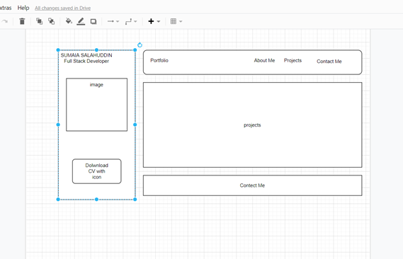
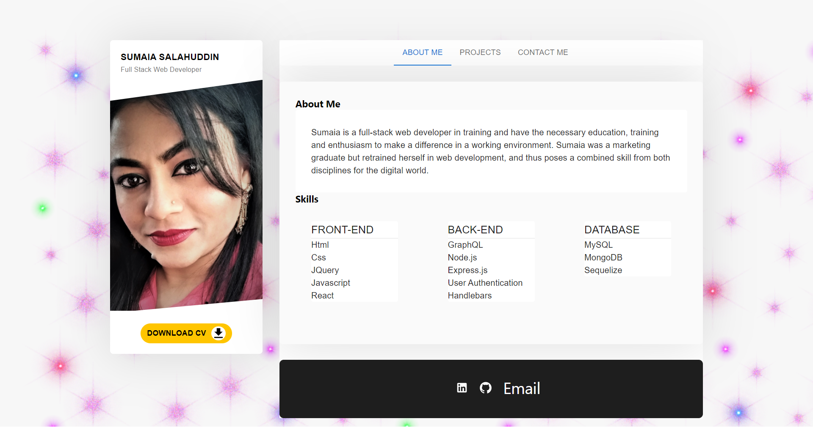
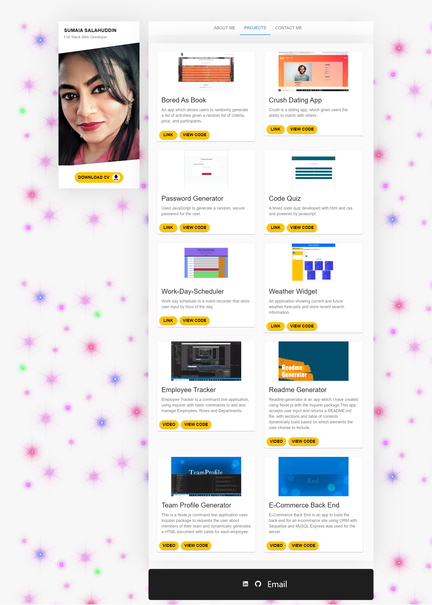
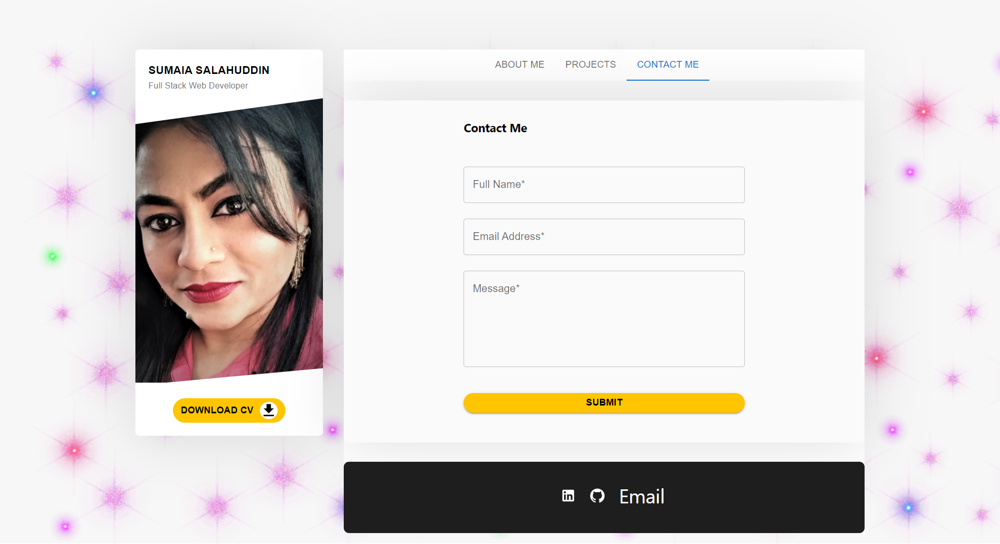

# Portfolio 

## Deployed URL

Click [here](https://sumaiasorna.github.io/react-portfolio/) to view deployed application on Github page.

## Repository Link

Click [here](https://github.com/SumaiaSorna/react-portfolio/tree/dev) to view Code on Github page.

## Table Of Contents

- [Getting Started](#getting-started)
- [Description](#description)
- [Deployed URL](#deployed-url)
- [Repository Link](#repository-link)
- [Technologies Used](#technologies-used)
- [Launch The App](#launch-the-app)
- [Layout Design](#layout-design)
- [Screenshots](#screenshots)
- [Questions](#questions)

## Getting Started

## Description

A clean and responsive personal portfolio built with React, displaying information about me, showcasing my projects,contact me page and contact links in the footer.

### Technologies Used

- React.js
- Javascript
- Material UI
- CSS

### Launch The App

```
npm run start
```

### Layout Design



## Screenshots







### Questions

If you have any questions about this application, please feel free to contact me in my <a href="mailto:sorna.sumaia@gmail.com">email.</a>
